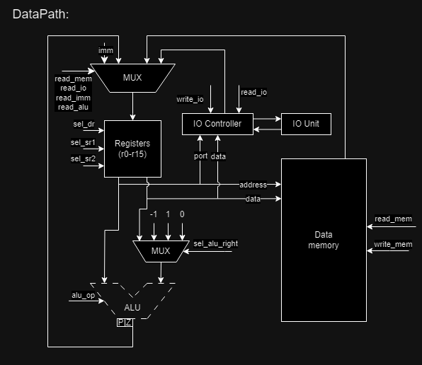
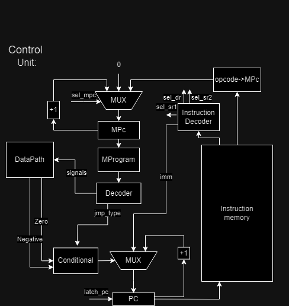

# Лабораторная работа №3 "Эксперимент"

## Вариант
```
asm | risc | harv | mc -> hw | tick -> instr | struct | stream | port | pstr | prob1 | cache
```
 - Бижанов Расул Сунгатович P3206
 - Базовый вариант

### Расшифровка
   - Низкоуровневый язык ***Assembler*** с поддержкой меток
   - ***RISC*** архитектура процессора
   - ***Гарвардская архитектура*** (раздельная память для команд и данных)
   - Управление посредствам ***микрокода***
   - Симуляция с точностью до ***тактов***
   - Машинный код хранится как ***высокоуровневая структура***
   - ***Потоковый*** ввод-вывод (без прерываний)
   - Устройства ввода-вывода адресуются через ***порты*** (особые инструкции для ввода-вывода)
   - ***Pascal strings*** (длина строки + содержимое)
   - Project euler problem 1 (алгоритм для реализации на языке forth)
   - ~~Кэширование~~ (не реализовано)

## Оглавление
1. [Вариант](#вариант)
    - [Расшифровка](#расшифровка)
2. [Язык программирования](#язык-программирования)
   - [Синтаксис](#синтаксис)
   - [Семантика](#семантика)
   - [Литералы](#литералы)
   - [Типы аргументов](#типы-аргументов)
3. [Организация памяти](#организация-памяти)
4. [Система команд](#система-команд)
5. [Транслятор](#транслятор)
6. [Модель процессора](#модель-процессора)
7. [Тестирование](#тестирование)
8. [Статистика](#статистика)

## Язык программирования

Реализуется подмножество языка Assembler для программ из задания. [Сами программы](algorithms). 

### Синтаксис

```ebnf
program ::= <section_code> <section_data> | <section_data> <section_code> | <section_code>
<section_data> ::= "section .data:" <data>
<section_code> ::= "section .code:" <code>
<data> ::= (<comment> | <variable>) <data>
<code> ::= (<comment> | <label> | <instruction>) <code>
<comment> ::= "#" <character>*
<label> ::= "."<name> ":"
<name> ::= [a-zA-Z]+
<variable> ::= <name> ":" (<int> | <string>)
<reg=> ::= "x0" | "x1" | "x2" | "x3" | "x4" | "x5" | "x6" | "x7" | "x8" | "x9" | "x10" | "x11" | "x12" | "x13" | "x14" | "x15"
<string> ::= '"' <character>* '"'
<character> ::= any printable ASCII character
<int> ::= - <DIGIT>+ | <DIGIT>+
<ter_ops> ::= ("add" | "sub" | "mod" | "div" | "and" | "or") " " (<reg> ", " <reg> ", " <reg>)
<bin_ops> ::= ("ld" | "st" | "mov" | "not") " " (<reg> ", " <reg>)
<un_ops> ::= ("inc" | "dec" | "neg") " "  (<reg>)
<imm_load> ::= "movi" " " (<reg> ", " (<name> | <int>))
<branch> ::= ("jmp" | "je" | "jg") " " (<label>)
<io_ops> ::= ("in" | "out") " " (<reg> ", " <reg>)
<zero_arg> ::= ("hlt" | "nop")
<instruction> ::= <ter_ops> | <bin_ops> | <un_ops> | <imm_load> | <branch> | <io_ops> | <zero_arg>
```

### Семантика
Код выполняется последовательно, одна инструкция за одной.

Список доступных [инструкций](). 

Помимо команд из системного уровня программисту доступны команды:

* `WORD <literal>` – объявить переменную в памяти.
* `BUF <amount>` – инициализировать в памяти буфер на `amount` элементов.
Содержимое буфера по умолчанию `0`

Метки определяются на отдельной строке исходного кода:

```asm
label:
        word 42
```

Далее метки могут быть использованы (неважно, до или после определения) в исходном коде:

```asm
label_addr:
        word label ; в памяти будет хранится адрес на ячейку памяти word 42
```

Метки не чувствительны к регистру. Повторное определение меток недопустимо.  
Определение меток `label` и `LaBeL` считается повторением.

Использовать определённую метку можно неограниченное число раз.  
Транслятор поставит на место использования метки адрес той инструкции, перед которой она определена.

Любая программа обязана иметь метку `start`, указывающую на первую исполняемую команду.

### Литералы
   1. Любое целое число воспринимается как команда положить это число на вершину стека.
   2. Строка (область ограниченная `"`) воспринимается как инициализация строки в памяти. Ее можно вывести с помощью `.`. Пример этого в программе [hello world](algorithms/hello_world.fth).  

### Типы аргументов
   1. Регистры (x0-x15)
   2. Операнд (адреса, значения, метки)

## Организация памяти

* Вся внешняя память - статическая, SRAM
* Машинное слово – не определено. Инструкции хранятся в высокоуровневой структуре данных.
* Размер операнда – не определен. Интерпретируется как знаковое целое число.
* Программа и данные хранятся в раздельной памяти согласно Гарвардской архитектуре.
  Программа состоит из набора инструкций, последняя инструкция – `hlt`.
* Адресация – прямая, абсолютная, доступ к словам.
* Программист не взаимодействует с адресами памяти данных на прямую.
  Транслятор сам решает, в каком месте выделить память под программу и под данные программы.
* Литералы - знаковые числа. Константы отсутствуют.
* Доступ к памяти осуществляется по адресу из любого регистра общего назначения

## Система команд

Особенности процессора:

* Машинное слово – не определено.
* Тип данных - знаковые числа или символы ascii (в рамках модели на python эти типы так и хранятся)
* Поток управления:
  * Значение `PC` инкриминируется после исполнения каждой инструкции;
  * Условные (`JG`, `JE`) и безусловные (`JUMP`) переходы;
  * Микропрограммное управление - каждый такт выполняется одна микрокоманда и посредствам счетчика микрокоманд решается, какая станет следующей. 

Набор инструкций:

* `nop` – нет операции.
* `in { taget_reg }` - ввод данных из устройств ввода вывода в `taget_reg`.
* `out { source_reg }` - вывод данных в устройства ввода вывода из `source_reg`.
* `mov { taget_reg, source_reg }` - переложить значение из `source_reg` в `taget_reg`.
* `movi { taget_reg, immediate }` - положить значение `immediate` в `taget_reg`.
* `ld { target_reg, address_reg }` – загрузить в `taget_reg` из памяти значение по адресу из `address_reg`.
* `st { address_reg, register }` – положить значение в память по адресу из `address_reg`.
* `inc { register }` - увеличить значение регистра на 1.
* `dec { register }` - уменьшить значение регистра на 1.
* `neg { register }` – записать в регистр значение `-register`.
* `add { taget_reg, source_reg_1, source_reg_2 }` – положить в `taget_reg` результат операции сложения `source_reg_1 + source_reg_2`.
* `sub { taget_reg, source_reg_1, source_reg_2 }` – положить в `taget_reg` результат операции вычитания `source_reg_1 + source_reg_2`.
* `div { taget_reg, source_reg_1, source_reg_2 }` – положить в `taget_reg` результат операции деления `source_reg_1 / source_reg_2`.
* `mod { taget_reg source_reg_1, source_reg_2 }` – положить в `taget_reg` результат операции взятия остатка от деления `source_reg_1 % source_reg_2`.
* `and { taget_reg, source_reg_1, source_reg_2 }` – положить в `taget_reg` результат операции логического И `source_reg_1` и `source_reg_2`.
* `or { taget_reg, source_reg_1, source_reg_1 }` – положить в `taget_reg` результат операции логического ИЛИ `source_reg_1` или `source_reg_2`.
* `not { target_reg, source_reg }` - положить в `taget_reg` результат операции логического НЕ `source_reg`.
* `jg { register, program_address }` – если значение в `register` больше 0, начать исполнять инструкции по указанному адресу. Условный переход.
* `je { register, program_address }` – если значение в `register` равно 0, начать исполнять инструкции по указанному адресу. Условный переход.
* `jump { program_address }` – безусловный переход по указанному адресу.
* `hlt` – остановка тактового генератора.

Взятие операнда из регистра - `{ register }` или `{ source_reg }`. \
Направление результата в регистра `{ taget_reg }`
s
Согласно [варианту](#вариант) машинный код хранится в высокоуровневой структуре. 
Это реализуется списком словарей (в python соответствуют json объектам).
Один элемент списка — это одна инструкция.
Индекс инструкции в списке – адрес этой инструкции в памяти команд.

Пример скомпилированной программы:
```json
{
  "data_mem": {
  	"0": 23,
  	"1": 23
  },
  "start": 0
  "code_mem": {
          "0": {
              "opcode": "command",
              "args": [
		"arg1",
                "arg2",
		"arg3"
              ]
          }
	}
}
```
Где:
* `data_mem` – память данных
* `start` -  точка входа в памяти инструкций
* `code_mem` – память инструкций
* `opcode` - некоторая инструкция
* `args` - аргументы инструкции

Система команд реализована в модуле [isa](/isa.py).

## Транслятор
Формат запуска: `./translator.py <input_file> <target_file> ` 
Реализован в [translator.py](/translator.py)
Компиляция осуществляется в 4 прохода по тексту программы:
- Проход препроцессора: удаление пустых строк и комментариев
- Проход по секции .data: преобразовывает данные в словарь переменная -> адрес в памяти данных.
- Первый проход по секции .code: получает словарь метка -> адрес в памяти команд.
- Второй проход по секции .code: подставляет все переменные и метки используя словари полученные на этапах выше.

## Модель процессора
Формат запуска: `./vm.py <machine_code_file> <input_file>`
### DataPath


Реализован в классе `DataPath`.
- `Registers (r0-r15)` - регистры общего назначения
- `IO Controller` - контроллер внешних устройств
- `IO Unit` - внешнее устройство

Сигналы:
- `WriteMem` - записать значение в память
- `ReadMem` - прочитать значение из памяти
- `WriteIO` - записать занчение во внешнее устройство
- `ReadIO` - прочитать значение из внешнего устройства
- `SelectSourceRegisterRight` - подать регистр на правый вход ALU
- `IncRight` - подать 1 на правый вход ALU
- `DecRight` - подать -1 на правый вход ALU
- `ZeroRight` - подать 0 на правый вход ALU
- `ReadImmidate` - записать в регистр значение операнда из исполняющейся инструкции
-  `ReadALU` - записать в регистр значение операнда из ALU
-  `SumALU` - просуммировать значения в правом и левом входе ALU
-   `SubALU` - вычесть из левого, правое значение входа ALU
-   `NegALU` - вычислить обратное по сложению
-   `DivALU` - выполнить операцию деления (DIV) на значениях, поданных на входы ALU
-    `ModALU` - выполнить операцию взятия остатка от деления (MOD) на значениях, поданных на входы ALU
-    `AndALU` - выполнить логическую операцию И (AND) на значениях, поданных на входы ALU.
-    `OrALU` - выполнить логическую операцию ИЛИ (OR) на значениях, поданных на входы ALU.
-    `NotALU` -  выполнить логическую операцию НЕ (NOT) на значении, поданном на вход ALU
-    `CmpALU` - выполнить операцию сравнения (CMP) значений, поданных на входы ALU
-   `PCJumpTypeJE` - выполнить переход по адресу, если результат предыдущей операции ALU равен нулю (JE - Jump if Equal)
-    `PCJumpTypeJG` - выполнить переход по адресу, если результат предыдущей операции ALU больше нуля (JG - Jump if Greater)
-    `PCJumpTypeJump` - выполнить безусловный переход по адресу (Jump)
-    `PCJumpTypeNext` - перейти к следующей инструкции (Next PC)

  Флаги:
- `zero` - отражает наличие нулевого значения в аккумуляторе.
- `positive` - отражает наличие положительного значения в аккумуляторе
### ControlUnit


Реализован в классе `ControlUnit`

- `Program Counter `- счетчик команд
- `Conditional` - логическая схема, для управления ветвлением
- `Decoder` - интерпретатор микрокоманд
- `Micro Program Counter (MPC)` - счетчик микрокоманд;
- `Instruction Decoder` - интерпретатор машинных инструкций

Сигналы:
-    `MicroProgramCounterZero` - сбросить счетчик микропрограммы в ноль
-    `MicroProgramCounterOpcode` - установить счетчик микропрограммы на значение кода операции
-    `MicroProgramCounterNext` -  перейти к следующему состоянию микропрограммы
-    `LatchPC` - защелкнуть текущее значение программного счетчика (PC)
-    `LatchMPCounter` - защелкнуть текущее значение счетчика микропрограммы (MPC)

# Тестирование проекта

Тестирование осуществляется при помощи golden test-ов.
Настройки golden тестирования находятся в файле `tests/test_machine.py`.
Конфигурация golden test-ов лежит в директории `golden`.

## Тестовое покрытие

- `cat` – повторяет поток ввода на вывод;
- `hello user` – печатает на выход приветствие пользователя;
- `hello world` – печатает на выход “Hello, world!”;
- `prob1` – сумма чисел от 1 до 1000, кратные 3 либо 5.

## Запустить тесты

```sh
pytest tests/test_machine.py

## CI
CI описывается в файла python.yaml:
```yaml
name: Python CI/CD

on:
  push:
    branches:
      - master
  pull_request:
    branches:
      - master

jobs:
  test:
    runs-on: ubuntu-latest

    steps:
      - name: Checkout code
        uses: actions/checkout@v4

      - name: Set up Python
        uses: actions/setup-python@v4
        with:
          python-version: 3.11

      - name: Install dependencies
        run: |
          python -m pip install --upgrade pip
          pip install poetry
          poetry install

      - name: Run tests and collect coverage
        run: |
          poetry run coverage run -m pytest .
          poetry run coverage report -m
        env:
          CI: true

  lint:
    runs-on: ubuntu-latest

    steps:
      - name: Checkout code
        uses: actions/checkout@v4

      - name: Set up Python
        uses: actions/setup-python@v4
        with:
          python-version: 3.11

      - name: Install dependencies
        run: |
          python -m pip install --upgrade pip
          pip install poetry
          poetry install

      - name: Check code formatting with Ruff
        run: echo Ok

      - name: Run Ruff linters
        run: poetry run ruff check .


## Пример тестирования
```sh
$ pytest tests/test_machine.py 
=================================================================================== test session starts ====================================================================================
platform linux -- Python 3.12.3, pytest-8.2.1, pluggy-1.5.0
rootdir: /home/Daniil/Desktop/BIZHAN/csa-lab-puk
configfile: pyproject.toml
plugins: regressions-2.5.0, datadir-1.5.0, golden-0.2.2, typeguard-4.2.1, anyio-4.3.0
collected 4 items                                                                                                                                                                          

tests/test_machine.py ....                                                                                                                                                           [100%]

==================================================================================== 4 passed in 0.54s =====================================================================================

```

## Статистика 
```text
| ФИО                      | алг        | LoC | code инстр. | инстр. | такт. | вариант                                                               |
| Бижанов Расул Сунгатович | hello user | 64  | 42          | 385    | 768   | asm | risc | harv | mc | tick | struct | stream | port | pstr | prob1 |
| Бижанов Расул Сунгатович | cat        | 10  | 5           | 48     | 94    | asm | risc | harv | mc | tick | struct | stream | port | pstr | prob1 |
| Бижанов Расул Сунгатович | hello world| 10  | 19          | 90     | 178   | asm | risc | harv | mc | tick | struct | stream | port | pstr | prob1 |
| Бижанов Расул Сунгатович | prob1      | 49  | 32          | 115    | 228   | asm | risc | harv | mc | tick | struct | stream | port | pstr | prob1 |
```
